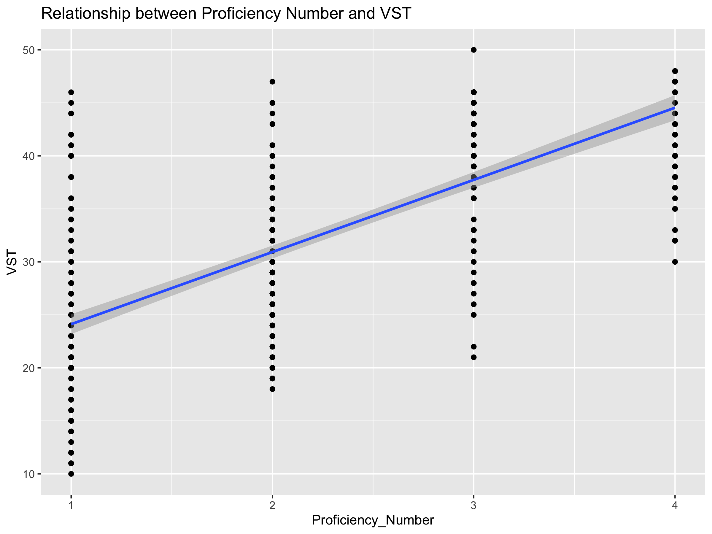
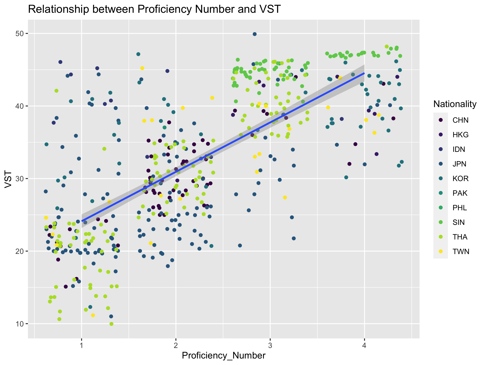

```{r setup, include=FALSE}
knitr::opts_chunk$set(echo = TRUE)
```
[Back to Homepage](https://kristopherkyle.github.io/IntroQuantALRM/)

# Loading data, more visualization, assumptions, significance, effect size
## Tutorial Objectives
**The objectives of this tutorial are to:**

- Load data into R from a .csv file
- Continue to build proficiency with creating (and interpreting) data visualizations
  - scatterplots
  - boxplots
- Be introduced to some important terms and concepts in statistical analysis:
  - mean 
  - median 
  - mode 
  - variance 
  - standard deviation
  - normal distribution
  - probability 
  - statistical significance
  - effect size

# Part I: Loading data, more practice with visualizing data

## Description of Data
The data represents a sample of a simplified (and adapted) version of the meta data for the written section of the <a href = "https://language.sakura.ne.jp/icnale/" target="_blank">International Corpus Network of Asian Learners of English</a>. This corpus includes argumentative essays written on two prompts by college students for a range of countries in Asia. As we see below, this file includes a number of variables including a participant identifier, nationality of the participant, their score on a <a href="https://www.lextutor.ca/tests/vst/index.php?mode=test" target="_blank">vocabulary size test (VST)</a>, and their English proficiency.

## Loading data
In previous tutorials, we have used dataframes that are part of the R base package or are part of ggplot2. Here, we will load data from a spreadsheet that is formatted as a comma separated values (.csv) document.

Our first step will be to open a new R script and save it in a convenient location (e.g., in a folder named "Rday3" on your desktop).

Our second step will be to download the [target .csv file](https://raw.githubusercontent.com/kristopherkyle/IntroQuantALRM/main/data/ICNALE_500_simple.csv.zip), extract it, and save a copy of the target .csv file ("ICNALE_500_simple.csv") in a folder called "data" in the Rday3 folder.

Third, with our new R script open in RStudio, we will click on "Session" in the toolbar and "Set Working Directory"" to "Source File Location". This will let RStudio know where to look for your file(s).

Finally, we will load our target .csv file ("ICNALE_500_simple.csv") as a dataframe (and in this case we will call that dataframe "fundata"). 

```{r}
fundata <- read.csv("data/ICNALE_500_simple.csv", header = TRUE) #this presumes that the .csv file is in a subfolder entitled "data"
summary(fundata)
```

Based on the summary output, we see that our dataframe has four variables (Participant, Nationality, VST, Proficiency_CEFR, and Proficiency_Number).

These variable names represent the following:
- Participant: Participant identifier
- Nationality: Nationality of participant
- VST: Score on receptive vocabulary size test
- Proficiency_CEFR: Categorical proficiency rating based on the Common European Framework of Reference for Languges (CEFR)
- Proficiency_Number: CEFR rating converted to a numerical scale (ranging from 1 to 4)

## Visualizing the data

Lets apply what we learned in the last tutorial to this new data. Don't forget to load ggplot2!

```{r, results = "hide"}
library(ggplot2)
library(viridis) #color-friendly palettes
```

### Scatterplots
First, lets create a scatterplot with a line of best fit to examine the relationship between VST (y-axis) and Proficiency_Number (x-axis). **What does the scatterplot indicate about the relationship between VST scores and Proficiency?**

```{r}
g1 <- ggplot(data = fundata) +
  geom_point(mapping = aes(x = Proficiency_Number, y = VST)) +
  geom_smooth(mapping = aes(x = Proficiency_Number, y = VST), method = lm) +
  scale_color_viridis(discrete = TRUE) +
  labs(
    x = "Proficiency_Number",
    y = "VST",
    title = "Relationship between Proficiency Number and VST")

#print(g1)
```

```{r, echo=FALSE, results='asis'} 
ggsave("plot1.png", plot = g1, width = 8, height = 6) # this is for the plot's alt text is correctly displayed in the HTML

cat('')
```

Now try to make the following plot, which shows the data by nationality (hint, I also used geom_jitter()).

```{r}
g2<- ggplot(data = fundata) + #this line indicates my dataset
  geom_jitter(mapping = aes(x = Proficiency_Number, y = VST, color = Nationality)) + #this line sets the x and y axis
  geom_smooth(mapping = aes(x = Proficiency_Number, y = VST), method = lm) +
  scale_color_viridis(discrete = TRUE) +
  labs(
    x = "Proficiency_Number",
    y = "VST",
    title = "Relationship between Proficiency Number and VST")

#print(g2)
```

```{r, echo=FALSE, results='asis'}
ggsave("plot2.png", plot = g2, width = 8, height = 6) # for the alt text

cat('')
```


Now, lets look at the trends by creating a different scatterplot for each (note that ncol = 3). **What do these scatterplots tell us about the relationship between VST scores and Proficiency across L1 groups/learning environments?**

```{r}
g3 <- ggplot(data = fundata) + #this line indicates my dataset
  geom_jitter(mapping = aes(x = Proficiency_Number, y = VST, color = Nationality)) + #this line sets the x and y axis
  geom_smooth(mapping = aes(x = Proficiency_Number, y = VST), method = lm) +
  facet_wrap(~ Nationality, ncol = 3) +
  scale_color_viridis(discrete = TRUE) +
  labs(
    x = "Proficiency_Number",
    y = "VST",
    title = "Relationship between Proficiency Number and VST across Nationalities"
  )

#print(g3)
```

```{r, echo=FALSE, results='asis'}
ggsave("plot3.png", plot = g3, width = 8, height = 6) # this is for the plot's alt text is correctly displayed in the HTML

cat('')
```

### Boxplots

Now, lets treat proficiency as a categorical variable. Create a graph with boxplots that shows the range of VST scores (y-axis) by Proficiency_CEFR (x-axis).

```{r}
g4<- ggplot(data = fundata) + 
  geom_boxplot(mapping = aes(x = Proficiency_CEFR, y = VST)) +
  labs(
    x = "Proficiency_CEFR",
    y = "VST",
    title = "VST Distribution by Proficiency Level"
  )

#print(g4)
```

```{r, echo=FALSE, results='asis'}
ggsave("plot4.png", plot = g4, width = 8, height = 6) # for the alt text

cat('')
```

Now, lets remove the outliers in our base plot, and add the actual data points to the boxplot (vary the points by nationality).

```{r}
g5<- ggplot(data = fundata) + 
  geom_boxplot(mapping = aes(x = Proficiency_CEFR, y = VST), outlier.shape = NA) +
  geom_jitter(mapping = aes(x = Proficiency_CEFR, y = VST, color = Nationality), width = 0.2)+
  scale_color_viridis(discrete = TRUE)+
  labs(
    x = "Proficiency_CEFR",
    y = "VST",
    title = "VST Distribution by Proficiency Level")

#print(g5)
```

```{r, echo=FALSE, results='asis'}
ggsave("plot5.png", plot = g5, width = 8, height = 6) # for the alt text

cat('')
```

# Part II: Assumptions, significance, and effect size

In this section, R code is provided to help demonstrate concepts, but don't worry about the code. The main purpose of this section is to introduce the concepts (not the code). We will revisit some of the code in later tutorials as applicable.

## Some preliminary concepts in statistics

## Mean, median, and mode

To demonstrate the concepts of mean, median, and mode, we will create a short list of numbers:

```{r}
samplelist <- c(1,1,2,3,4,4,5,5,6,6,7,7,7)
```

__mean__ The mean is what the general population refers to as the "average" score. 

To get the mean, we divide the sum of the observed values by the number of observations. In R, we can use the "mean()" function to calculate the mean score. As we see below, the mean value of our sample list is 4.461538.

```{r}
mean(samplelist)
```

__median__ The median is the middle observed values (when all values are arranged in ascending/descending order). 

Our sample list is sorted in ascending order and includes 13 items. The middle observed value (the 7th value) is 5. In R we can use the "median()" function to calculate the median score.

```{r}
median(samplelist)
```


__mode__ The mode is the observed value that occurs most often.

To get the mode, we can simply count the frequency of each item in the list. The most frequent item is the mode. In our sample list, 7 occurs more than any other number (in this case, 3 times) and is therefore the mode. Base R does not have a function to calculate the mode (though there are packages that can be used for this purpose). Because we won't need to calculate the mode for any analyses this term, we won't worry about this too much.

## Variance and standard deviation
The definitions below may seem a bit technical. If that is the case, don't worry too much. We will discuss these (particularly standard deviation) in class.

__population variance__ The variance in a set of observed values indicate how these values are distributed. To calculate the variance, we first subtract the mean from each of our observed values and square each of these values. We then calculate the mean for the squared values.

__population standard deviation__ The standard deviation is the square root of the variance.

__sample variance__ When we calculate the variance for a sample, we need to account for the fact that smaller samples will not perfectly reflect the population. In this case, when we calculate the mean for the squared values, we have to subtract one from the denominator. In small samples, this will have a large effect, but in large samples, the difference will be minimal. 

__sample standard deviation__ The sample standard deviation is simply the square root of the sample variance.

### Calcuating descriptive statistics in R

Below, we will load our sample data, which comes from the ICNALE corpus. In this case, we will be looking specifically at Vocabulary Size Test (VST) scores. Then, we will look at some descriptive statistics related to VST scores in the dataset, including the mean, median, variance, and standard deviation.

```{r}
fundata <- read.csv("data/ICNALE_500_simple.csv", header = TRUE) #load data
cat("mean VST score:", mean(fundata$VST),"\n")  #mean VST score 
cat("median VST score:", median(fundata$VST),"\n")  #median VST score
cat("variance in VST score", var(fundata$VST), "\n") #variance in VST scores - by default this is the sample variance
cat("standard deviation of VST scores", sd(fundata$VST), "\n") #standard deviation of VST scores - by default this is the sample standard deviation
```

As we can see, the mean score is around 32.5, the median score is similar (33), the variance is 94.65, and the standard deviation is around 9.7 (which,as a reminder, is the square root of the variance. Below, we will see some of the ways in which these statistics are useful.

## Checking assumptions: Normality
Many statistical tests require data that is normally distributed. These statistical tests are referred to as "parametric" statistical tests. Below, we will see how to to determine the degree to which our data is normally distributed both visually and statistically.

### Visualizing distributions
In a normal distribution, the median and the mean values will be the same, and ~68% of the data points will be within one standard deviation of the mean. The figure below shows the shape of a normal distribution.

```{r}
library(ggplot2)

#don't worry too much about this code - take a look at the plot
g6<- ggplot(data = data.frame(x = c(-3, 3)), aes(x)) +
  stat_function(fun = dnorm, n = 500, args = list(mean = 0, sd = 1)) + ylab("") + xlab("VST  (but not really - this is too perfect)") +
  scale_y_continuous(breaks = NULL)+
  labs(
    title = "Normal Distribution Curve"
  )

#print(g6)
```

```{r, echo=FALSE, results='asis'}
ggsave("plot6.png", plot = g6, width = 8, height = 6) # for the alt text

cat('')
```

One way that we can check the degree to which our data is normally distributed is to check whether its distribution is similar to a perfectly normal distribution. In the plot below, the blue line represents a normal distribution with the mean and standard deviation of VST scores. The red line represents the actual distribution of VST scores.

```{r}
#This code may be useful in the future, but don't worry about it too much right now.
custom_colors <- c("Density" = "#377eb8", "Normal Curve" = "orange") 

g7<- ggplot(fundata, aes(x = VST)) + 
  geom_density(aes(color = "Density")) +  #Assigning a name to the color aesthetic
  # geom_histogram(aes(y = ..density.., fill = "Histogram"), binwidth = 3) +
  stat_function(fun = dnorm, n = 500, args = list(mean = mean(fundata$VST), sd = sd(fundata$VST)), aes(color ="Normal Curve")) +
  ylab("") +
  xlab("VST") +
  scale_y_continuous(breaks = NULL) +
  scale_color_manual(values = custom_colors) +  #scale_color_viridis(discrete = TRUE) is possible, but for better visibility
  labs(
    title = "Density and Normal Distribution of VST Scores"
  )

#print(g7)
```

```{r, echo=FALSE, results='asis'}
ggsave("plot7.png", plot = g7, width = 8, height = 6) # for the alt text

cat('')
```

It appears as though our data is not normally distributed (the red line that represents the actual data doesn't look very much like the blue line, which represents a normal distribution). 

Another way we can visually check our distribution is to use qq plots. If our data is normally distributed, then our actual data points will fall along our theoretical line (see plot below).

```{r}
#don't worry too much about this code for now
g8<- ggplot(fundata, (aes(sample=VST))) + #note that the sample is the variable we are examinining
  stat_qq() + #this adds the points
  stat_qq_line() + #this adds the theoretical line
  labs(
    title = "Q-Q Plot of VST")

#print(g8)
```

```{r, echo=FALSE, results='asis'}
ggsave("plot8.png", plot = g8, width = 8, height = 6) # for the alt text

cat('')
```

In this case, we see that many of our observed data points fall above or below the theoretical line. This is further indication that our data is not normally distributed

### Using a statistical test to check for normality
However, we can also test to see the degree to which the observed distribution differs from the theoretical one using the Shapiro-Wilk test. In this case, if the _p_ value is small (e.g., below .05), then we can assume that our observed distribution significantly differs from a normal distribution (i.e., it is not normal). Note that R often uses scientific notation for very small numbers. If you see a number followed by "e" and a negative number _n_, then you simply move the decimal place to the left _n_ times. For example, 5.151e-3 should be interpreted as .005151.

```{r}
shapiro.test(fundata$VST)
```

As we can see from the output, the VST scores are not normally distributed, indicating that we should not use parametric statistics using these values. Fortunately, there are a number of non-parametric tests that can be used (more on this later).

## More assumptions
Each statistical test has a variety of assumptions. As we learn about different tests, we will learn about these assumptions (and what to do if our data violates them).

## Significance and Effect Size

In quantitative research, we want to determine the probability that our observations (e.g., relationships between two variables or differences between groups) are due to chance (or, alternatively, are due to something such as a particular teaching method). As we will see below, probability estimates are inextricably connected to sample size. Accordingly, we also want to know how large the differences between the two populations are or how strong the relationship between two variables are (via an effect size).  

## Probability and Statistical Significance
Statistical significance is inherently tied to probability. In this course we will talk about a number of (relatively) complicated methods for determining the probability of observing a particular result, but in this tutorial we will keep things reasonably simple. In real research, for example, we might want to know whether vocabulary test scores are significantly different between two groups of students (who received different instructional methods, were in different educational context, had different L1s, etc.). We will get to that issue soon enough, but for now we are going to examine a simpler issue. Given a particular population (lets say a group of intermediate language learners at a particular institution), what is the probability that a particular student will earn a particular score?

Let us assume for a moment that the scores are normally distributed with a range from 30 to 50, a mean of 40, and a standard deviation of 5.

```{r}
#don't worry too much about this code - see the plot
library(dplyr)
library(ggplot2)

distr <- data.frame(x=seq(30, 50, length=300)) %>%
  mutate( density = dnorm(x, mean=40, sd=5))

g9<- ggplot(distr, aes(x=x, y=density)) +
  geom_line() +
  geom_area() +
  theme_bw() +
  labs(
    x = "Score",
    y = "Density",
    title = "Normal Distribution of Scores")

#print(g9)
```


```{r, echo=FALSE, results='asis'}
ggsave("plot9.png", plot = g9, width = 8, height = 6) # for the alt text

cat('')
```

One thing that we can examine is the probability that a student in the target population will receive a particular VST score. For example, what is the probability that a student randomly selected from our sample population would earn a 34 on the VST? By looking at a density plot, we can see that there is a very small chance that we would randomly select a smaller score than 34 and a much larger chance that we would randomly select a score higher than 34. 

```{r}
#don't worry too much about this code - see the plot
distr <- data.frame(x=seq(30, 50, length=300)) %>%
  mutate(density = dnorm(x, mean=40, sd=5),
          group = ifelse(x<=34, 'Worse score than 34','Better score than 34'))

g10<- ggplot(distr, aes(x = x, y = density, fill = group)) +
  geom_line() +
  geom_area(alpha = 0.5) +  # Adjusting transparency for better visualization
  scale_fill_viridis(discrete = TRUE) +  # Applying a color-blind friendly palette
  theme_bw() +
  labs(
    x = "Score",
    y = "Density",
    title = "Probability Distribution of Scores")

#print(g10)
```

```{r, echo=FALSE, results='asis'}
ggsave("plot10.png", plot = g10, width = 8, height = 6) # for the alt text

cat('')
```

To check these probabilities precisely, we can use the pnorm() function.

```{r}
#don't worry too much about this code
pnorm(34, mean = 40, sd = 5)
```

The pnorm() function indicates that 11.5% of students (_p_ = .115) scored lower than our randomly selected student. In other words, there is only an 11.5% chance that we would observe a smaller score from a randomly selected student. Conversely, this means that there is an 88.5% (0.885) chance thqt we would observe a higher score from a randomly selected student.

### Class data as a sample from a larger population

In classic quantitative research, we are rarely interested in what a single student does, rather, we tend to be interested in what groups of students tend to do. When designing studies, we take a sample of students from a population and then measure particular characteristics of the sample.

It is important to note that the characteristics of our samples will not necessarily perfectly reflect the characteristics of our population (due to sampling error). The larger the sample we take, however, the more likely our sample will reflect the population characteristics.

So, if we sample ten students from our vocabulary learning population (which has a mean score of 40) multiple times (we will do this three times below), we can expect to get a wider range of mean scores than if we sample 100 students from our population (we will do this three times below as well).

```{r}
set.seed(124) #set random number generator seed
mean(rnorm(10, mean = 40, sd = 5)) #get random sample of 10 data points from a normal distribution with a mean of 40 and an sd of 5; get the mean score
mean(rnorm(10, mean = 40, sd = 5))
mean(rnorm(10, mean = 40, sd = 5))
```


```{r}
set.seed(124) #set random number generator seed
mean(rnorm(100, mean = 40, sd = 5)) #get random sample of 100 data points from a normal distribution with a mean of 40 and an sd of 5; get the mean score
mean(rnorm(100, mean = 40, sd = 5))
mean(rnorm(100, mean = 40, sd = 5))
```

As we can see, the range of mean scores for the randomly sampled groups is closer to the population mean when the sample size is larger. When the sample size is 10, the mean scores can range over a point from the mean; when the sample size is 100, the mean scores are less than .5 point from the population mean. Note that if our standard deviation was wider, then these differences would be more pronounced.

This range will be even smaller if we take a larger sample (e.g., n=1000):

```{r}
set.seed(124) #set random number generator seed
mean(rnorm(1000, mean = 40, sd = 5)) #get random sample of 100 data points from a normal distribution with a mean of 40 and an sd of 5; get the mean score
mean(rnorm(1000, mean = 40, sd = 5))
mean(rnorm(1000, mean = 40, sd = 5))
```

Importantly, if we randomly sample a population many times (e.g., 1,000) with a particular sample size, we can get a probability distribution of the mean scores. With this distribution, we can determine the probability that, given a random sample of _n_ participants from a population with a particular distribution, we would get a particular mean score.  

### Statistical significance with two groups (introduction)

In (slightly) more complex situations, we might want to know whether one group of students (whose teacher used a new fancy vocabulary instruction method) earned higher vocabulary test scores than a second group of students (whose teacher used a boring old method of vocabulary instruction). The question we will ask (statistically) is the probability that the mean VST scores from the two groups could have come from the same population (i.e., students who studied vocabulary) OR if there is something special about one of the groups. We do this by checking the degree to which the mean scores could overlap in a repeated random sample from each group of observed scores (the actual calculation is slightly more complicated than this, but not much).

If the probability is high that the mean VST scores came from the same larger group (i.e., individuals who are in a language course), then we might say that the teaching method didn't make a difference in VST scores. If the probability that the mean scores could come from the same distribution of scores is low (usually this is set to a probability or _p_ value of .05), then we might say that the teaching method affected the scores. 

There are many caveats and more complicated situations that we will tackle when we look at each test covered in this course. Stay tuned.

As we noted above, the larger the sample size is, the more confident we can be that the sample mean represents the population mean. 

## Effect sizes
A very important limitation of tests of statistical significance is that they are affected by both the sample size and the size of the observed differences (i.e., the effect). When the sample size is large enough, almost all differences between two groups will be considered statistically significant (due to the Central Limit Theorem).

Effect sizes, however, are not affected by sample size and simply indicate the difference in average values across two populations (for difference tests) or how closely related two sets of variables are (for tests related to correlations). There are a number of different effect size calculations (we will learn a few of these as we learn different statistical tests), but arguably the most common are Cohen's D (for difference tests) and _r_ (for correlations). We'll discuss _r_ when we discuss correlations. 

### Cohen's D
Cohen's D is calculated as the |((mean of group A - mean of group B)/pooled standard deviation)|. In short, this tells us how many standard deviations apart the means for the two groups are.

Below, we have two samples (lets call them two classes with VST scores). The red line represents the distribution of VST scores in our previously discussed class (mean=40, sd = 5). The blue line represents the distribution of VST scores in an imaginary, high achieving class (mean = 45, sd = 5).

```{r}
#don't worry too much about this code - see the plot
distr1 <- data.frame(x = seq(30, 50, length = 300)) %>%
  mutate(density = dnorm(x, mean = 40, sd = 5))

distr2 <- data.frame(x = seq(35, 55, length = 300)) %>%
  mutate(density = dnorm(x, mean = 45, sd = 5))

# Combine the data frames and add a grouping variable (added for plotting)
combined_distr <- rbind(distr %>% mutate(group = "distr1"),
                        distr2 %>% mutate(group = "distr2"))

# Plot
g11<- ggplot(combined_distr, aes(x = x, y = density, color = group)) +
  geom_line() +
  scale_color_viridis(discrete = TRUE) +
  theme_bw() +
  labs(
    x = "VST",
    y = "Density",
    title = "Comparative Normal Distributions of Two Samples")

#print(g11)
```

```{r, echo=FALSE, results='asis'}
ggsave("plot11.png", plot = g11, width = 8, height = 6) # for the alt text

cat('')
```

To calculate Cohen's D for the difference between these two samples, we subtract the mean of the blue class (45) from the mean of the red class (40), which leaves us with (40-45 = -5). We then divide this number by the pooled standard deviation (in this case 5). So, Cohen's D = (|-5/5| = 1.00), which is a large effect (according to Cohen, 1988). 

More soon!
